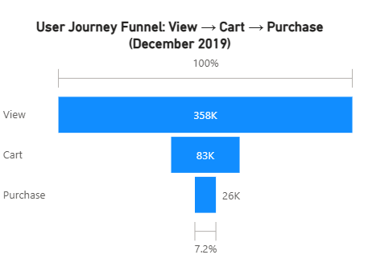
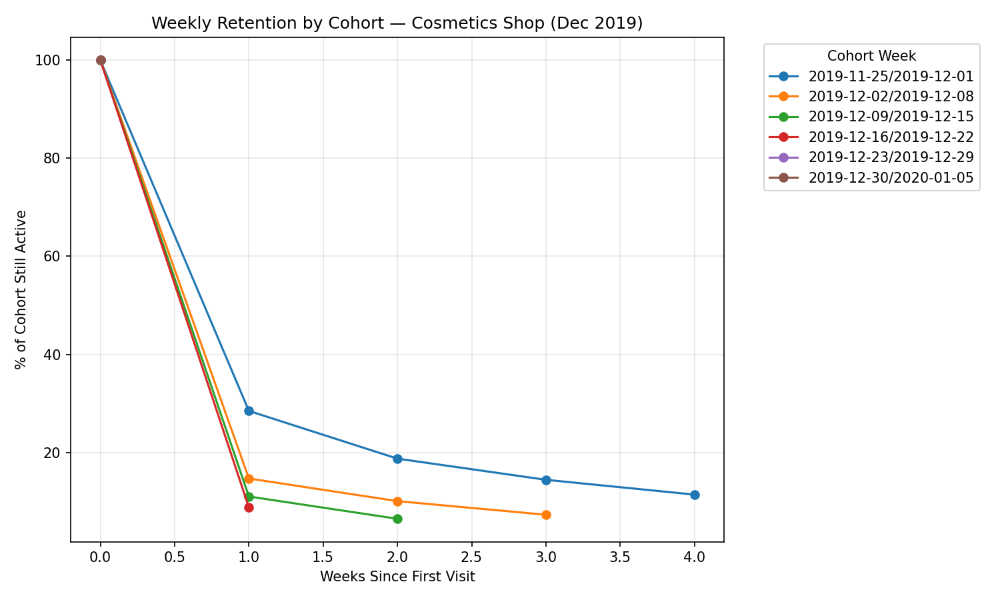

# E-Commerce Funnel & Retention Analysis
### Cosmetics Shop — December 2019

Analysis of 3.5M user events (view, cart, purchase) across 358,212 users to identify funnel drop-off points and retention patterns, with a validated measurement methodology.

---

## Executive Summary

- Overall funnel conversion (View → Purchase) was **7.15%**, notably above typical e-commerce benchmarks (commonly cited around 2–3%).
- The relative weak point in the funnel is **Cart → Purchase (30.69%)**, not View → Cart (23.30%) — suggesting checkout friction is a larger opportunity area than product-page engagement.
- Retention shows a steep **one-time-shopper pattern**: the majority of users do not return within a week of their first visit, regardless of signup cohort.
- Among fully-observed periods, retention appears to **decline as December progresses** (28.5% → 14.7% → 11.0% → 8.7% one-week retention across successive cohorts), a pattern worth investigating against holiday shopping behavior.
- A validation test (A/A test) confirmed the measurement methodology produces no false-positive differences (p = 0.619), supporting confidence in the funnel and retention findings above.

---

## Funnel Findings

| Stage | Unique Users | Conversion from Previous Stage |
|---|---|---|
| View | 358,212 | — |
| Cart | 83,458 | 23.30% |
| Purchase | 25,613 | 30.69% |
| **Overall (View → Purchase)** | — | **7.15%** |

**View → Cart (23.30%)** is strong relative to typical e-commerce add-to-cart rates (often 5–10%), suggesting product pages and browsing experience are performing well — cosmetics shoppers appear to engage readily with products.

**Cart → Purchase (30.69%)** is reasonable but represents the larger relative leak in the funnel. Cart abandonment is a well-documented industry-wide problem (often 60–80% of carts are abandoned across e-commerce broadly), and this dataset's abandonment rate sits within that normal range — meaning there is real room for improvement here specifically, more so than earlier in the funnel.

**Recommendation:** Prioritize investigation of checkout-stage friction — payment method availability, late-revealed shipping costs, and forced account creation are common causes of cart abandonment and would be the first places to audit.

---

## Retention Findings

Users were grouped into weekly cohorts based on their first recorded activity date, and tracked for return activity in subsequent weeks.

| Signup Week | Week 0 | Week 1 | Week 2 | Week 3 | Week 4 |
|---|---|---|---|---|---|
| 2019-11-25 – 12-01 | 100% | 28.5% | 18.7% | 14.4% | 11.4% |
| 2019-12-02 – 12-08 | 100% | 14.7% | 10.0% | 7.3% | — |
| 2019-12-09 – 12-15 | 100% | 11.0% | 6.4% | — | — |
| 2019-12-16 – 12-22 | 100% | 8.7% | — | — | — |
| 2019-12-23 – 12-29 | 100% | — | — | — | — |

*Note: Figures exclude partially-observed final periods due to right-censoring at the dataset's end date (Dec 31, 2019) — each cohort's most recent period was not yet fully complete within the observation window and has been omitted for comparability.*

**Pattern 1 — The one-time-shopper problem:** Every cohort shows a steep decline from Week 0 to Week 1 (e.g., the Dec 2 cohort drops from 97,070 to 14,238 active users — roughly an 85% one-week drop-off). The majority of users appear to visit once and not return within the following week. Retention flattens somewhat in later weeks for those who do return, indicating that the critical window for re-engagement is the **first 7 days**, not later in the lifecycle.

**Pattern 2 — Declining retention as December progresses:** Comparing only fully-observed Week 1 values across cohorts (28.5% → 14.7% → 11.0% → 8.7%), retention appears to decline steadily as the month progresses. This may reflect holiday-season shopping behavior — later-December visitors may skew toward one-time gift purchasers with lower inherent return intent, compared to earlier-December regular shoppers. This is a plausible explanation, not a confirmed cause, and would benefit from further segmentation (e.g., by purchase category) to validate.

**Recommendation:** Prioritize a "second visit within 7 days" re-engagement effort (e.g., email or push notification) targeted at new users, given how much of the retention drop happens in that first week. Additionally, consider testing holiday-specific retention offers for late-December cohorts specifically, given their comparatively lower early retention.

---

## Methodology Validation (A/A Test)

Before trusting the analysis methodology on a real experiment, an A/A test was run: users were randomly split 50/50 into two groups with no actual treatment difference between them, and their conversion rates were compared.

- Group A conversion: **8.73%**
- Group B conversion: **8.77%**
- Two-proportion z-test: Z = -0.497, **p = 0.619**

Since p ≥ 0.05, there is no statistically significant difference between the randomly-split groups — the expected and correct outcome for an A/A test. This confirms the measurement approach does not produce false-positive results, validating its use for the funnel and retention analysis in this report, and for any future real A/B tests using the same methodology.

---

## Recommendations Summary

1. **Investigate checkout-stage friction** (payment options, shipping cost visibility, account-creation requirements) — the largest relative leak in the funnel.
2. **Launch a "second visit within 7 days" re-engagement campaign** for new users, given the steep Week 0 → Week 1 retention drop across every cohort.
3. **Test holiday-season-specific retention offers** for late-December cohorts, given their comparatively lower early retention — pending further validation of the underlying cause.

---

## Data & Limitations

- **Source:** Public e-commerce event dataset (cosmetics shop), December 2019, 3,533,286 events across 358,212 unique users.
- **Window:** Single calendar month — later cohorts have fewer fully-observed retention periods due to right-censoring at the dataset's end date; this was explicitly accounted for in the retention analysis above.
- **A/B group assignment:** Simulated via random 50/50 split for methodology demonstration purposes, not drawn from a live product experiment.
- **Scope:** Findings and recommendations are based on behavioral event data only; no external context (marketing spend, pricing changes, promotional calendar) was available to incorporate into this analysis.
